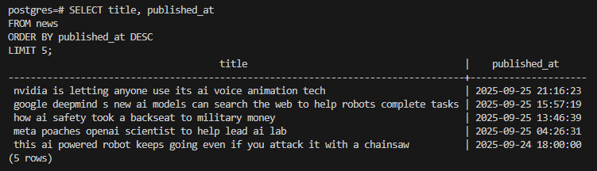
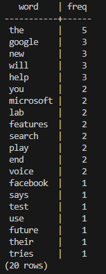
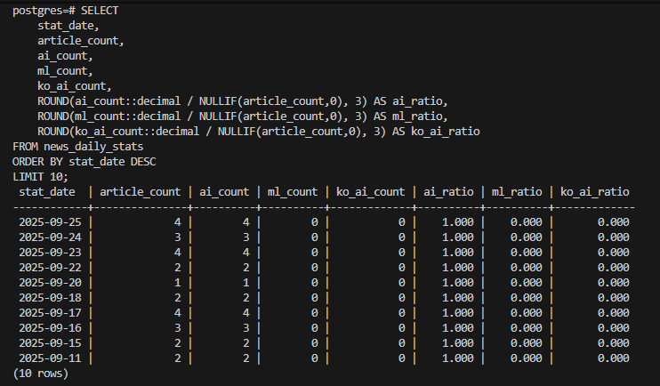

# 📰 뉴스 데이터 파이프라인 (Airflow + Postgres + Slack)

## 📌 프로젝트 개요
- 뉴스 API로 AI 관련 기사 수집 → 전처리 → CSV 저장 → Postgres 적재 → 일별 집계
- Airflow DAG으로 파이프라인 오케스트레이션
- Slack 알림 (성공/실패) 연동
- 개발 환경: Ubuntu WSL2 + Python venv
- Docker Compose 이사 대비: `.env` 기반 설정 구조 설계

---

## ⚙️ 실행 방법
```bash
# 1. venv 생성 및 패키지 설치
python -m venv venv
source venv/bin/activate
pip install -r requirements.lock

# 2. .env 파일 작성
cat > .env <<EOF
NEWS_API_KEY=your_api_key_here
DB_HOST=localhost
DB_NAME=postgres
DB_USER=postgres
DB_PASSWORD=your_password
DB_PORT=5432
DATA_DIR=/home/cha/news_project_data
TZ=Asia/Seoul
EOF

# 3. Airflow 초기화 및 실행
airflow db init
airflow connections delete slack_default >/dev/null 2>&1 || true
airflow connections add slack_default \
  --conn-type slackwebhook \
  --conn-password 'https://hooks.slack.com/services/XXX/YYY/ZZZ'

bash bootstrap_airflow.sh
```

## 📊 데이터 분석 예시

- 최신 기사 샘플  
  

- 단어 빈도 (최근 7일, Top 20)  
  

- 일별 기사 수 및 키워드 비율  
  

👉 전체 SQL 쿼리와 설명은 [docs/sql_results.md](docs/sql_results.md) 참고
